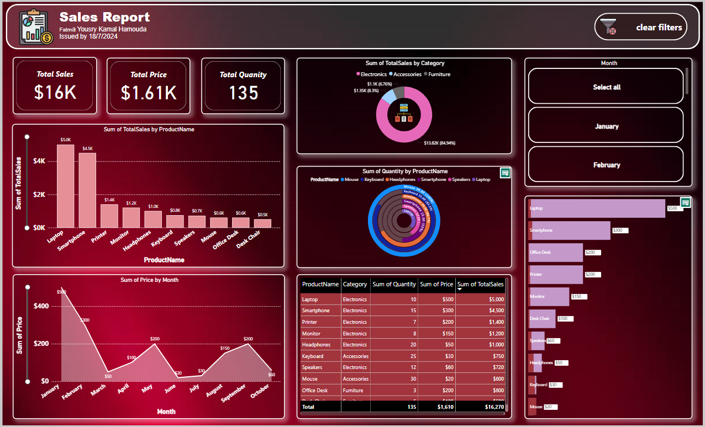

# Sales Report using Power BI

This project involves the creation of a **Sales Report** using **Power BI** to visualize and analyze sales data. The report includes key performance indicators (KPIs), trends, and insights that help in decision-making for sales strategies.

## Table of Contents
- [Introduction](#introduction)
- [Features](#features)
- [Technologies Used](#technologies-used)
- [Getting Started](#getting-started)
- [Dataset](#dataset)
- [Report Sections](#report-sections)
- [Visualization](#visualization)
- [License](#license)

## Introduction
This Power BI report provides a comprehensive analysis of sales data, helping users track the sales performance, product sales trends, and key customer segments. The report is designed for sales teams and business decision-makers to gain actionable insights and improve business operations.

## Features
- **Sales KPIs**: Displays key performance metrics such as total sales, profit margin, and sales growth.
- **Trend Analysis**: Visualizes month-over-month sales trends and product-wise performance.
- **Customer Segmentation**: Identifies top customers based on sales volume and profitability.
- **Product Sales Insights**: Provides insights into product categories that drive sales and those with declining trends.

## Technologies Used
- **Power BI**: For creating the interactive sales report.
- **Data Source**: Excel file containing sales data.

## Getting Started
To view or customize this sales report, follow these steps:

1. **Install Power BI**: Make sure you have Power BI Desktop installed. You can download it from [Microsoft's official website](https://powerbi.microsoft.com/desktop/).
2. **Download Report File**: Clone this repository and open the `sales_report.pbix` file in Power BI Desktop.
3. **Load Data**: Ensure the correct dataset is linked to the Power BI report or update it with your own data by going to the `Transform Data` section.

## Dataset
The dataset used in this report includes:
- **Date**: The transaction date.
- **Sales Amount**: The total sales in currency.
- **Product Category**: Different product categories sold.
- **Customer Segment**: The type of customers (e.g., corporate, individual).
- **Geographical Data**: The location where sales occurred.
  
The dataset can be easily replaced with your own by updating the data source in Power BI.

## Report Sections
1. **Sales Overview**: Summary of total sales, number of transactions, and top-selling products.
2. **Sales by Product Category**: A detailed breakdown of sales by each product category.
3. **Regional Sales**: Visual representation of sales performance across different regions.
4. **Customer Segmentation**: Highlights the highest revenue-generating customer segments.
5. **Monthly Sales Trends**: Visualizes the sales performance on a monthly basis.

## Visualization
Here is a snapshot of the Sales Report:

